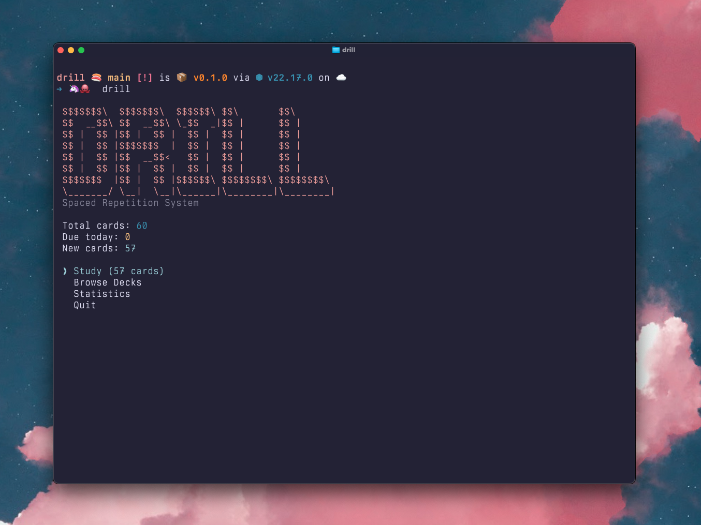
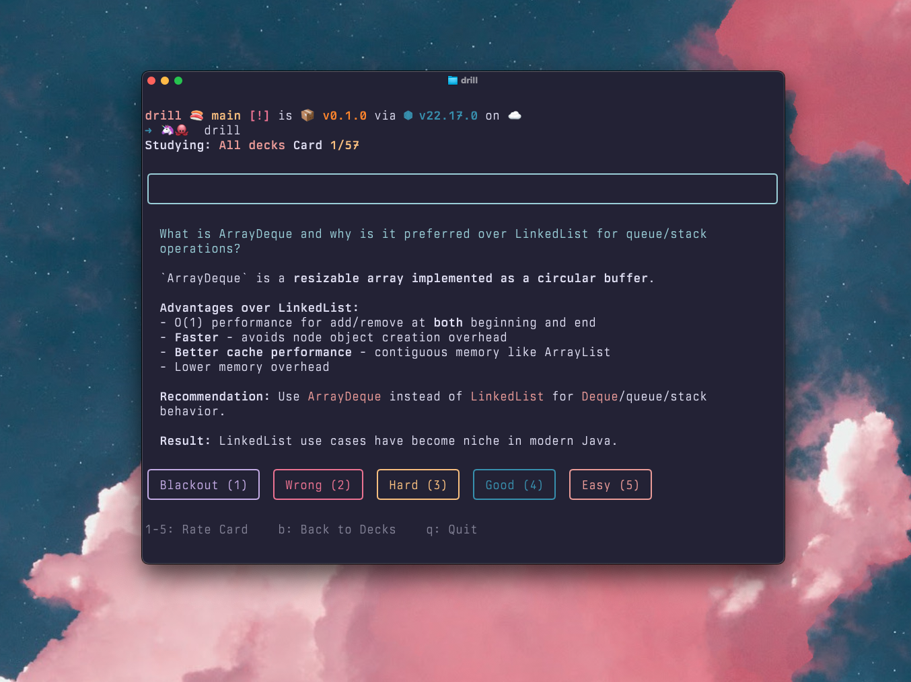
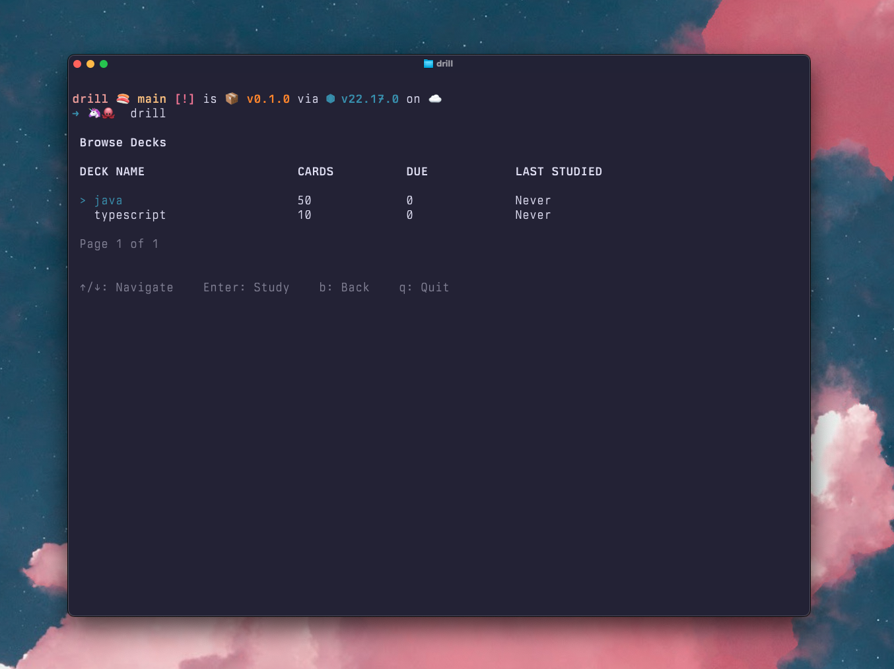
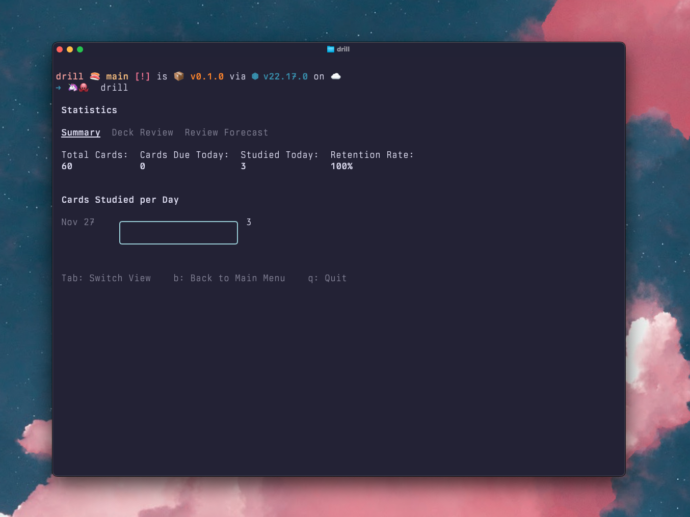
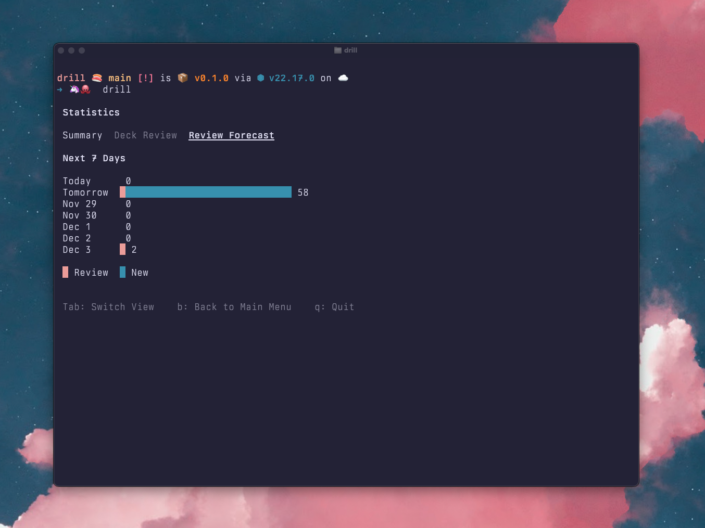

# Drill

Lightweight file-based spaced repetition system (SRS) using plain Markdown flashcards. Terminal UI for developers who prefer text files, Git version control, and keyboard-driven interfaces.

## What It Does

Drill helps you memorize anything using [spaced repetition](https://en.wikipedia.org/wiki/Spaced_repetition) - a learning technique that schedules reviews at optimal intervals. Store flashcards as Markdown files, study in the terminal, track progress with the SM-2 algorithm.

**Key Features:**
- **Markdown flashcards** - Plain text files with YAML frontmatter for metadata
- **SM-2 algorithm** - Proven spaced repetition scheduling (same as Anki)
- **File-based** - No database, works with Git, sync anywhere
- **Terminal UI** - Fast keyboard-driven interface using Ink (React for terminals)
- **Deck organization** - Organize cards into decks using directories
- **Statistics** - Track learning progress, review forecasts, retention rates

## Screenshots

<details>
<summary>Main Menu</summary>


</details>

<details>
<summary>Study Mode - Question</summary>


</details>

<details>
<summary>Browse Decks</summary>


</details>

<details>
<summary>Statistics Summary</summary>


</details>

<details>
<summary>Review Forecast</summary>


</details>

## Installation

### Install globally via npm

```bash
npm install -g drill-srs
drill
```

### Or clone and run locally

```bash
git clone https://github.com/yourusername/drill.git
cd drill
npm install
npm run build
npm start
```

For development:
```bash
npm run start
```

## Quick Start

### 1. Setup Card Directory

Create a directory for your flashcards (defaults to `~/drill`):

```bash
mkdir -p ~/drill/programming
```

Or specify a custom directory:
```bash
drill --dir /path/to/cards
# Or set environment variable:
export DRILL_DIR=/path/to/cards
```

### 2. Create Flashcards

Cards are Markdown files with YAML frontmatter. Create `~/drill/programming/binary-search.md`:

```markdown
---
tags: [algorithms, search]
created: 2025-01-15
last_reviewed: null
review_interval: 0
easeFactor: 2.5
repetitionCount: 0
---

# Binary Search

## Question

What is the time complexity of binary search?

## Answer

O(log n) - Binary search divides the search space in half with each comparison, leading to logarithmic time complexity.
```

### 3. Study

Run `drill` and navigate with keyboard:
- **Arrow keys** - Navigate menus
- **Enter** - Select option
- **1-5** - Rate card difficulty during study
- **q** - Quit/back
- **b** - Back to previous screen

## Card Format

### File Structure

Cards are Markdown files with three parts:

1. **YAML Frontmatter** - Metadata for spaced repetition
2. **Title** - `# Card Title` heading
3. **Question/Answer** - `## Question` and `## Answer` sections

### Example Card

```markdown
---
tags: [react, hooks]
created: 2025-01-20
last_reviewed: 2025-01-22
review_interval: 6
easeFactor: 2.6
repetitionCount: 2
difficulty: 4
---

# useEffect Dependencies

## Question

What happens if you omit the dependency array in useEffect?

## Answer

The effect runs after every render. Without dependencies:
- Effect runs on every component update
- Can cause infinite loops if effect triggers state changes
- Use empty array `[]` for mount-only effects
- Include dependencies for effects that should re-run when values change
```

### Frontmatter Fields

| Field | Type | Description |
|-------|------|-------------|
| `tags` | string[] | Categories/topics (e.g., `[react, hooks]`) |
| `created` | date | Creation date (YYYY-MM-DD) |
| `last_reviewed` | date\|null | Last review timestamp |
| `review_interval` | number | Days until next review (calculated by SM-2) |
| `easeFactor` | number | Difficulty multiplier (default: 2.5, min: 1.3) |
| `repetitionCount` | number | Successful reviews in a row |
| `difficulty` | number\|null | Last rating 1-5 (optional, for stats) |

**Note:** You only need to set `tags` and `created` manually. Other fields are managed by the SM-2 algorithm.

## Directory Structure

Organize cards into decks using directories:

```
~/drill/
├── programming/           # Deck: Programming
│   ├── algorithms.md
│   ├── data-structures.md
│   └── design-patterns.md
├── languages/            # Deck: Languages
│   ├── spanish-verbs.md
│   └── french-phrases.md
└── history/              # Deck: History
    └── world-war-2.md
```

Each directory = one deck. Drill recursively loads all `.md` files.

## Spaced Repetition (SM-2 Algorithm)

Drill uses the **SM-2 algorithm** (same as Anki) to schedule reviews:

### How It Works

1. **New cards** - Start with no review history
2. **First review** - Schedule for tomorrow (1 day)
3. **Second review** - Schedule for 6 days out
4. **Subsequent reviews** - Interval multiplied by "ease factor"

### Rating Scale

After revealing a card's answer, rate your recall:

- **1 - Blackout**: Complete failure, no memory
- **2 - Wrong**: Incorrect but recognized
- **3 - Hard**: Correct with significant difficulty
- **4 - Good**: Correct with some effort (ideal)
- **5 - Easy**: Perfect recall, trivial

### What Ratings Do

| Rating | Effect |
|--------|--------|
| **1-2** | Reset card to beginning (review tomorrow), decrease ease factor |
| **3** | Increment reviews but decrease ease factor (future intervals shorter) |
| **4** | Increment reviews, maintain ease factor (optimal) |
| **5** | Increment reviews, increase ease factor (future intervals longer) |

### Ease Factor

- **Default**: 2.5 (each interval is 2.5x longer)
- **Minimum**: 1.3 (prevents intervals from becoming too short)
- **Adjusted by ratings**: Hard cards get lower ease factors (more frequent reviews)

### Example Progression

Rating a card **4 (Good)** consistently:

```
Review 1: Tomorrow (1 day)
Review 2: 6 days out
Review 3: 15 days out (6 × 2.5)
Review 4: 37 days out (15 × 2.5)
Review 5: 92 days out (37 × 2.5)
```

Rating a card **3 (Hard)**:
```
Review 1: Tomorrow (1 day)
Review 2: 6 days out
Review 3: 10 days out (ease factor decreased to ~1.8)
Review 4: 18 days out (10 × 1.8)
```

Rating a card **1 or 2**: Resets to beginning, review tomorrow.

## Usage

### Main Menu

```
┌─ Main Menu ──────────────────────┐
│ Study (5 due)                    │
│ Browse Decks                     │
│ Statistics                       │
│ Quit                             │
└──────────────────────────────────┘
```

### Study Mode

Shows question, press any key to reveal answer, then rate 1-5:

```
Studying: All decks  Card 1/5

┌──────────────────────────────────┐
│ What is binary search?           │
└──────────────────────────────────┘

O(log n) search algorithm that divides 
the search space in half each iteration.

┌ Blackout (1) ┐ ┌ Wrong (2) ┐ ┌ Hard (3) ┐ ┌ Good (4) ┐ ┌ Easy (5) ┐

1-5: Rate Card    b: Back to Decks    q: Quit
```

### Browse Decks

View all decks with statistics:

```
┌─ Browse Decks ────────────────────┐
│ programming (15 cards, 5 due)     │
│ languages (8 cards, 2 due)        │
│ history (12 cards, 3 due)         │
└───────────────────────────────────┘
```

Select a deck to study only that deck.

### Statistics

Track learning progress:

```
┌─ Statistics ──────────────────────┐
│ Total Cards: 35                   │
│ Due Today: 10                     │
│ New Cards: 5                      │
│ Learning: 12                      │
│ Mature: 18                        │
└───────────────────────────────────┘

Deck Breakdown:
  programming: 15 cards (5 new, 8 learning, 2 mature)
  languages: 8 cards (0 new, 2 learning, 6 mature)
  history: 12 cards (0 new, 2 learning, 10 mature)
```

**Card States:**
- **New**: Never reviewed (`repetitionCount: 0`)
- **Learning**: Reviewed 1-2 times (`repetitionCount: 1-2`)
- **Mature**: Reviewed 3+ times (`repetitionCount: ≥3`)

## Keyboard Shortcuts

| Key | Action |
|-----|--------|
| **↑/↓** | Navigate menu items |
| **Enter** | Select menu item |
| **1-5** | Rate card difficulty (study mode) |
| **Space** | Reveal answer (if configured) |
| **q** | Quit/return to main menu |
| **b** | Back to previous screen |

## Configuration

### Base Directory

Three ways to set card location:

1. **Command-line flag**: `drill --dir /path/to/cards`
2. **Environment variable**: `export DRILL_DIR=/path/to/cards`
3. **Default**: `~/drill`

### Logging

By default, Drill only shows warnings and errors. Enable verbose logging:

```bash
# Show informational messages (loading decks, etc.)
LOG_LEVEL=INFO drill

# Show debug messages (detailed operations)
LOG_LEVEL=DEBUG drill

# Back to quiet mode (default)
LOG_LEVEL=WARN drill
```

### Creating New Cards

1. Create `.md` file in deck directory
2. Add YAML frontmatter with `tags` and `created`
3. Add title, question, and answer sections
4. Start studying - Drill will update metadata automatically

**Tip:** Use Git to version control your flashcards!

```bash
cd ~/drill
git init
git add .
git commit -m "Add programming flashcards"
```

## Development

### Project Structure

```
src/
├── index.ts              # CLI entry point
├── models/
│   ├── Card.ts           # Card data model
│   └── Deck.ts           # Deck data model + stats
├── store/
│   ├── CardStore.ts      # File system operations
│   ├── parser.ts         # Markdown → Card parsing
│   └── writer.ts         # Card → Markdown serialization
├── srs/
│   └── sm2.ts            # SM-2 spaced repetition algorithm
├── ui/
│   ├── App.tsx           # Main Ink application
│   ├── MainMenu.tsx      # Main menu screen
│   ├── StudyScreen.tsx   # Study interface
│   ├── BrowseDecks.tsx   # Deck browser
│   └── StatsScreen.tsx   # Statistics view
└── utils/
    ├── config.ts         # Configuration management
    └── dates.ts          # Date utilities
```

### Scripts

```bash
npm run build       # Compile TypeScript
npm start           # Run application
npm test            # Run tests
npm run test:watch  # Watch mode for tests
```

### Testing

Tests use Vitest:

```bash
npm test                    # Run once
npm run test:watch          # Watch mode
```

Key test files:
- `src/__tests__/sm2.test.ts` - SM-2 algorithm validation
- `src/__tests__/CardStore.test.ts` - File operations
- `src/__tests__/parser-writer.test.ts` - Markdown parsing

## Technical Details

### Dependencies

- **ink** - React-based terminal UI framework
- **react** - Required by Ink
- **gray-matter** - YAML frontmatter parsing
- **date-fns** - Date manipulation utilities
- **glob** - File pattern matching
- **yaml** - YAML serialization

### Card Lifecycle

1. **Load**: `CardStore.loadDecks()` reads all `.md` files
2. **Parse**: `parseMarkdownCard()` extracts frontmatter + content
3. **Study**: User reviews card, rates difficulty
4. **Update**: `calculateSM2()` computes new review schedule
5. **Save**: `serializeCard()` writes updated frontmatter to file

### SM-2 Implementation

See `src/srs/sm2.ts`:

```typescript
export function calculateSM2(card: Card, quality: number): SM2Result {
  // 1. Update ease factor based on difficulty rating
  // 2. Reset or increment repetition count
  // 3. Calculate new interval (1 day, 6 days, or exponential)
  // 4. Compute next review date
  return { interval, repetitions, easeFactor, nextReview };
}
```

**Key formula:**
```
easeFactor' = easeFactor + (0.1 - (5-q) * (0.08 + (5-q) * 0.02))
easeFactor' = max(1.3, easeFactor')
```

Where `q` is quality rating (1-5 mapped to 0-5 internally).

## Tips & Best Practices

### Writing Good Flashcards

1. **One concept per card** - Don't cram multiple facts
2. **Clear questions** - No ambiguity
3. **Concise answers** - Get to the point
4. **Use examples** - Concrete > abstract
5. **Add context** - Why does this matter?

### Organizing Decks

- Group related topics
- Keep deck size manageable (20-50 cards)
- Use tags for cross-cutting themes
- Review deck-specific cards when cramming

### Daily Routine

1. **Morning reviews** - Start with due cards
2. **New cards** - Add 5-10 new cards daily
3. **Consistency** - Daily reviews > long sessions
4. **Honest ratings** - Rate "3" if you struggled, even if correct

### Markdown Features

Cards support full Markdown:

```markdown
## Question

How do you create a list in Python?

## Answer

Use square brackets:
\`\`\`python
my_list = [1, 2, 3]
nested = [[1, 2], [3, 4]]
\`\`\`

**Operations:**
- `append(x)` - Add item
- `pop()` - Remove last
- `len(list)` - Get size
```

## Troubleshooting

### No cards showing?

- Check directory exists: `ls ~/drill`
- Verify `.md` files have correct format
- Check YAML frontmatter is valid
- Look for parse warnings in terminal

### Cards not saving?

- Check file permissions on `~/drill`
- Ensure deck directory exists
- Verify `filePath` in card metadata

### Algorithm seems wrong?

- Ratings 1-2 reset cards (by design)
- Rating 3 decreases ease factor (reviews come sooner)
- First two intervals are fixed: 1 day, then 6 days
- Subsequent intervals grow exponentially

### Running tests?

```bash
npm test
# Or for specific test:
npm test sm2
```

## License

ISC

## Contributing

1. Fork repository
2. Create feature branch
3. Add tests for new functionality
4. Submit pull request

## Acknowledgments

- **SM-2 Algorithm**: Created by Piotr Woźniak for SuperMemo
- **Ink**: Terminal UI framework by Vadim Demedes
- **Anki**: Inspiration for spaced repetition UX
